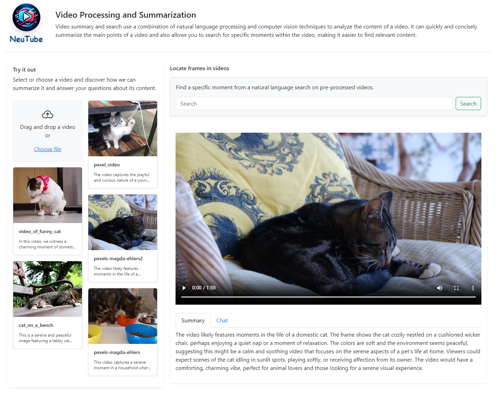

  

# Client-GPT-Vision  

## Description
Client-GPT-Vision is an Angular-based web application designed to interact with a video processing backend. It allows users to upload videos, view them in the browser, and access functionalities like generating summaries and asking questions about the video content, utilizing the backend services for processing.

## Requirements
- Node.js
- Angular CLI
- Bootstrap (for styling)

## Installation
To set up the development environment and run the application, follow these steps:

1. **Install Node.js**: Download and install Node.js from [the official website](https://nodejs.org/).

2. **Install Angular CLI**: Use npm (Node Package Manager) to install the Angular CLI globally:
  - `npm install -g @angular/cli`

3. **Clone the Repository**:
  - `git clone [https://github.com/neudesic/NeuTube/tree/main]`
  - `cd client-gpt-vision`

4. **Install Dependencies**: Navigate to the project directory and install the necessary packages:
  - `npm install`

## Running the Application
1. **Start the Angular Development Server**:
  - `ng serve`

This will compile the application and host it on a local development server.

2. **Access the Application**: Open a web browser and navigate to `http://localhost:4200` to view and interact with the application.

## Features
- **Video Upload**: Users can upload a video file which will be processed by the backend.
- **Video Playback**: Uploaded videos can be played directly in the browser.
- **Video Summary**: The application can request a summary of the video content from the backend.
- **Interactive Q&A**: Users can ask questions about the video content, and the backend will provide answers based on the video analysis.

## Contribution
Contributions to the project are welcome! Follow these steps to contribute:
- Fork the repository.
- Create a new branch for your feature.
- Make changes and test.
- Submit a pull request with a detailed description of your changes.

## Troubleshooting
If you encounter issues while setting up or running the application, consider the following:
- Ensure that Node.js and Angular CLI are correctly installed.
- Check if all npm dependencies are properly installed.
- Verify that the backend service is up and running.
